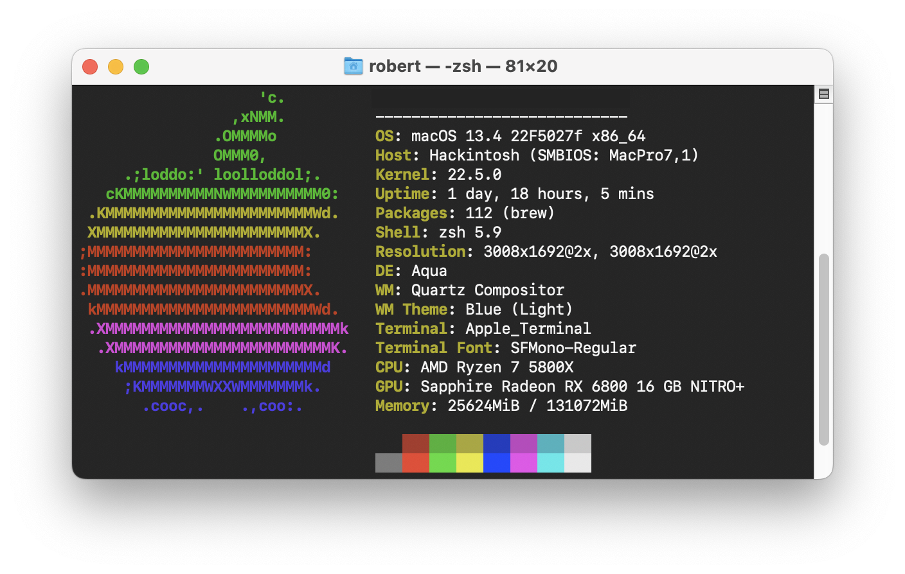

## Ryzentosh - Opencore EFI for MSI MAG X570 TOMAHAWK WIFI

Basic EFI folder to run macOS Big Sur on a MSI MAG X570 TOMAHAWK WIFI motherboard

### Build Specs

**MotherBoard** : MSI MAG X570 TOMAHAWK WIFI

**Processor**   : AMD Ryzen 7 5800X 8c/16t Processor

**Graphics**    : Sapphire Radeon RX 6800 16 GB NITRO+ 16 GB

**Memory**      : Kingston HyperX Predator 128 GB (4 x 32 GB) DDR4-3200 CL16

**Storage**     : Western Digital Blue SN550 1 TB M.2

**Wireless**    : Broadcom BCM94360NG + Bluetooth (Replaced the onboard Intel)

### Status
Everything is working just fine for me **except**

- Anything using Intel VT-d

### macOS Installation

**OpenCore**            :   0.8.6

**Kernel AMD Patches**  :   [AMD OSX GitHub][2]

**Version**             :   13.1 Beta (22C5050e) (Ventura) 

**SMBIOS**              :   MacPro7,1

#### Neofetch

### Guides Used

- [Opencore Guide][1]
- [Internal Drives shown as external][3]

- Credit to [theHari08]4 for the initial github.

[1]: https://dortania.github.io/OpenCore-Install-Guide
[2]: https://github.com/AMD-OSX/AMD_Vanilla
[3]: https://www.reddit.com/r/hackintosh/comments/f0cc4t/internal_drives_shown_as_external_opencore_amd
[4]: https://github.com/theHari08/MSI-MAG-X570-TOMAHAWK-WIFI-Hackintosh